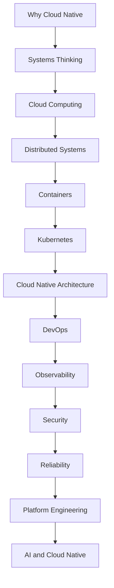

# License

All materials in this repository (software, educational content, diagrams, documentation, curricula, and associated assets) are © 2026 [Prof-it].

- You may use, copy, and modify these materials **for non-commercial purposes only**, with proper attribution.
- **Commercial use is strictly prohibited** without a separate commercial license from the authors. This includes use in paid products, commercial training, consulting, or any activity with a primary intent of commercial advantage or monetary compensation.
- The license applies to all text, code, images, diagrams, documentation, and educational resources in this repository.

For commercial licensing inquiries, please contact: Prof.dr.rer.nat.lu@gmail.com

See the [LICENSE](./LICENSE) file for full terms.
# License FAQ

**Q: Can I use these materials in my open-source project?**  
A: Yes, as long as your project is non-commercial and you provide proper attribution.

**Q: Can I use parts of this repo for my own public educational purposes?**  
A: Yes, provided you do so non-commercially and maintain attribution.

**Q: Can I use this in a paid course or training, or as part of consulting services?**  
A: No, commercial use is strictly prohibited without a separate license agreement. Please contact us to discuss commercial licensing.

**Q: Does the license cover diagrams, images and text?**  
A: Yes. The license applies to all code, diagrams, images, content, and educational materials in this repository.

**Q: What if I want to make a change or improvement?**  
A: You are encouraged to contribute improvements for non-commercial use! You must credit your changes and the original authors.

**Q: What about dependencies or referenced third-party material?**  
A: You must comply with the license terms of any included third-party material, which may differ from this license.


# Cloud Native Engineering Knowledge Base

## Mission

This repository is a long-term, vendor-neutral engineering knowledge base for designing, building, operating, and evolving production-grade cloud-native systems. It is intended to remain relevant across teaching, consulting, enterprise training, and applied research over the next five years and beyond.

The repository is organized around engineering problems and decision-making, not around tools, clouds, or lecture sessions.

## Learning Philosophy

The learning model used across this repository is:

WHY -> WHAT -> HOW -> TOOLS

Each topic starts from a real problem, explains core principles, then architecture and patterns, and only then discusses implementation and tools.

## Repository Structure

```text
.
|-- README.md
|-- docs/
|-- architecture/
|   |-- diagrams/
|   `-- reference-architectures/
|-- patterns/
|-- case-studies/
|-- labs/
|-- resources/
`-- assets/
```

## Learning Path

Start with the core path in `docs/00-learning-path.md` and then move through foundational reasoning documents before implementation domains.



## Who This Repository Is For

This repository is designed for:

- Senior undergraduate students and master students.
- Software, DevOps, cloud, platform, and AI infrastructure engineers.
- Technical and enterprise architects.
- Instructors, trainers, and consultants building reusable curricula.

## How Other Repositories Build on This One

This repository provides foundational concepts, architecture language, and pattern catalogs that future repositories can reference directly. Domain-specific repositories should link here for principles and shared definitions instead of duplicating foundational material.

## Boundary and Routing

This repository is the canonical foundation layer for cloud-native engineering knowledge under the Prof-it GitHub organization.

Routing principle:

- If content teaches universal principles, pattern logic, and decision trade-offs, it belongs here.
- If content defines reusable solution-level blueprints for specific enterprise contexts, it belongs in the dedicated reference-architectures repository.

Recommended organization:

- Layer 1 foundation repository (this repository): `Prof-it/cloud-native-engineering`
- Reference architecture repository: `Prof-it/reference-architectures`

### What Belongs in This Repository

- Core conceptual frameworks and system-level reasoning.
- Vendor-neutral pattern definitions and decision matrices.
- Teaching-oriented trade-off analysis and cross-topic vocabulary.
- Methods and standards for producing architecture assets.

### What Belongs in the Reference Architectures Repository

- Domain blueprints such as enterprise SaaS platform, fintech cloud platform, AI RAG platform, LLMOps platform, multi-region cloud, zero-trust platform, and internal developer platform.
- End-to-end architecture packs with context, constraints, diagrams, control models, and adaptation guidance.
- Versioned blueprint releases and evolution history.

### Practical Routing Rules

- Add content here when the answer is mostly WHY and WHAT.
- Add content to reference-architectures when the answer is mostly HOW at solution architecture level.
- Keep provider-specific mappings optional and in appendices, never as primary organization.
- Link both repositories bidirectionally to avoid duplication.

### Content Handoff Pattern

Use this foundation repository to define principles and patterns, then publish concrete architecture blueprints in the reference-architectures repository that explicitly reference those principles.

Example flow:

1. Define resilience pattern and decision logic here.
2. Apply the pattern in a fintech or SaaS reference architecture there.
3. Feed lessons learned back here as generalized guidance.

## Contribution and Maintenance

Reader-facing content in this repository is intentionally separated from private maintainer and agent runbooks.

## Future Roadmap

- Expand reference architectures by domain (data, AI, security, platform).
- Add comparative pattern decision guides.
- Add structured case study analyses with failure narratives.
- Add capability-based labs and assessment rubrics.
- Build companion repositories that consume this foundation.
