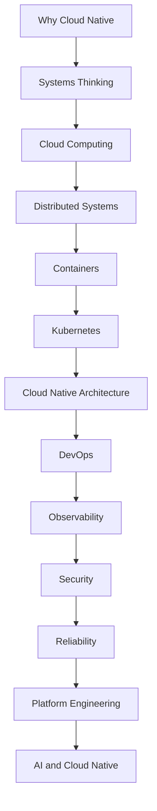

<!-- Cloud Native Engineering Knowledge Base: Documentation README -->

# Cloud Native Engineering Knowledge Base

> **Vendor-neutral engineering knowledge for designing, building, operating, and evolving production-grade cloud-native systems.**

This repository is a structured, continuously evolving knowledge base for **Cloud Computing, Distributed Systems, Cloud Native Architecture, DevOps, Platform Engineering, Observability, Security, Reliability, and AI infrastructure**.

It is developed from university teaching, applied research, and professional engineering practice, focusing on **engineering judgment rather than tool familiarity**.

The goal is not to provide another collection of technology-specific tutorials. Instead, the repository organizes the concepts, patterns, architectural approaches, and practical exercises needed to reason about complex cloud-native systems.

---

## Table of Contents

- [Engineering First, Tools Second](#engineering-first-tools-second)
- [Start Here: Learning Path](#start-here-learning-path)
- [Repository Structure](#repository-structure)
- [Why This Approach?](#why-this-approach)
- [Who This Repository Is For](#who-this-repository-is-for)
- [Teaching and Professional Use](#teaching-and-professional-use)
- [Foundation and Specialization](#from-foundation-to-application)
- [Engagement & Contribution](#engage-with-the-knowledge-base)
- [License](#license)
- [About the Author](#about-the-author)

---

## Engineering First, Tools Second

The learning approach follows:

**WHY → WHAT → HOW → TOOLS**

| Layer  | Question                        | Focus                                   |
|--------|----------------------------------|-----------------------------------------|
| **WHY**   | What problem are we solving?      | Requirements, constraints, trade-offs   |
| **WHAT**  | What concepts and principles apply? | Systems, architecture, patterns      |
| **HOW**   | How can the problem be addressed?  | Architectures, implementation approaches |
| **TOOLS** | Which technologies can implement it?| Kubernetes, cloud platforms, CI/CD, IaC, etc. |

> Tools change quickly. Engineering principles, architectural reasoning, and decision-making skills remain useful much longer.

---

## Start Here: Learning Path

The recommended learning path progresses from foundational systems thinking toward modern cloud-native and AI infrastructure engineering:



➡️ See the full learning path: [docs/00-learning-path.md](00-learning-path.md)

---

## Repository Structure

The repository is organized by engineering knowledge domains, not just individual lectures.

```
cloud-native-engineering/
│
├── architecture/          # Architectural concepts and approaches
├── assets/                # Images, diagrams, and supporting assets
├── case-studies/          # Engineering scenarios and case studies
├── docs/                  # Structured learning documentation (this folder)
├── labs/                  # Practical exercises and experiments
├── patterns/              # Reusable engineering patterns
├── resources/             # Curated references and further resources
├── scripts/               # Supporting scripts and automation
│
├── .github/               # Repository workflows and config
├── .gitignore
├── LICENSE
└── README.md
```

See documentation in each folder for further details and entry points.

---

## Why This Approach?

Typical cloud-native engineering is often taught through individual technologies (Docker → Kubernetes → Terraform → GitHub Actions → Cloud Provider).

That approach can produce tool familiarity but does not necessarily develop sound engineering judgment.

This knowledge base takes the opposite direction:

**Problem → Principles → Architecture → Implementation → Technology**

The emphasis is therefore on questions such as:
- What problem are we actually solving?
- What constraints matter?
- Which architectural properties are required?
- What trade-offs are involved?
- Which patterns are applicable?
- How should reliability, security, observability, and operability be addressed?
- Only then: which technologies and platforms are appropriate?

This makes the material useful across changing technology landscapes and cloud providers.

---

## Who This Repository Is For

- **Students:** Senior undergrad and Master's who want to understand cloud-native engineering beyond individual technologies. Useful for structured learning, exercises, projects, and technical preparation.
- **Software, DevOps, Cloud & Platform Engineers:** Those who want to strengthen understanding of architectural and engineering principles.
- **Architects:** For software, cloud, enterprise, and platform architects working on distributed/cloud systems.
- **Educators & Trainers:** For instructors, lecturers, and consultants needing reusable, structured material for teaching cloud-native engineering.
- **Engineering Leaders:** Technical leads who need a shared language around architecture, reliability, security, platform engineering, and technology decisions.

---

## Teaching and Professional Use

This knowledge base is developed and used in university teaching in areas including Cloud Computing, DevOps, and Cloud Native Engineering.

It is designed to work both as:
- a structured learning path,
- a reference during courses,
- supporting material for practical exercises,
- a foundation for student projects,
- and a reusable engineering reference beyond a single course.

The same engineering foundations are applicable in professional development, enterprise training, and architecture initiatives.

---

## From Foundation to Application

This repository provides a public, vendor-neutral foundation:
- engineering principles
- architectural concepts
- design patterns
- decision frameworks
- learning material
- practical exercises
- case studies

Material here can be adapted for:
- university curriculum
- professional training
- enterprise engineering organizations
- project-based education
- AI, MLOps, or platform engineering
- architecture and technology decision workshops

Specialized, domain-specific architectures build on—but do not duplicate—these foundations.

---

## Engage With the Knowledge Base

This is a living, continuously improved engineering resource.

If you find the material useful:
- ⭐ **Star** the repository so others can discover it
- 👀 **Watch** for updates
- 💬 **Discuss** by starting conversations
- 🐛 **Open issues** for errors, outdated information, or unclear explanations
- 💡 **Suggest improvements or additional topics**
- 🍴 **Fork** to experiment/adapt
- 🔀 **Contribute** examples, labs, patterns, references, or improvements

Feedback from students, educators, engineers, and practitioners is especially valued—it helps identify where explanations or learning material can be improved.

---

## Contribution and Maintenance

This is a carefully curated public educational and engineering resource. Useful contributions include:
- clarifications, corrections, improved explanations
- new labs, examples, architecture diagrams, patterns, case studies
- references or practical exercises

Please focus on reusable engineering knowledge (not private notes or organization-specific documentation).

---

## License

The repository is publicly available for non-commercial educational use with attribution.
- **Commercial use, including training/consulting, requires separate permission under the repository license.**
- See [LICENSE](../LICENSE) for complete terms.
- © 2026 Prof-it. All rights reserved except as expressly permitted by the license.

---

## About the Author

**Prof. Dr. rer. nat. Tianxiang Lu, SFHEA, IEEE Senior Member**

Professor of DevOps and Cloud Computing at IU International University of Applied Sciences, Germany. Dr. Lu holds a binational PhD in Computer Science (Saarland University, Germany & University of Lorraine, France), with foundational research at MPI, DFKI, and INRIA focused on automated reasoning, knowledge representation and formal verification.

With more than 20 years of technical and consulting experience—including a decade of enterprise leadership in highly regulated industries such as financial services—Dr. Lu has architected and delivered cloud, DevSecOps, and AI solutions at scale.

His research vision centers on Trustworthy AI Engineering: enabling reliable, secure, and verifiable AI in distributed and cloud-native systems. He is an IEEE Senior Member, SFHEA, contributor to the IEEE Functional Safety Standards Committee, and has supervised over 200 theses. He regularly speaks at major international conferences and is a recipient of multiple best paper awards.

---
