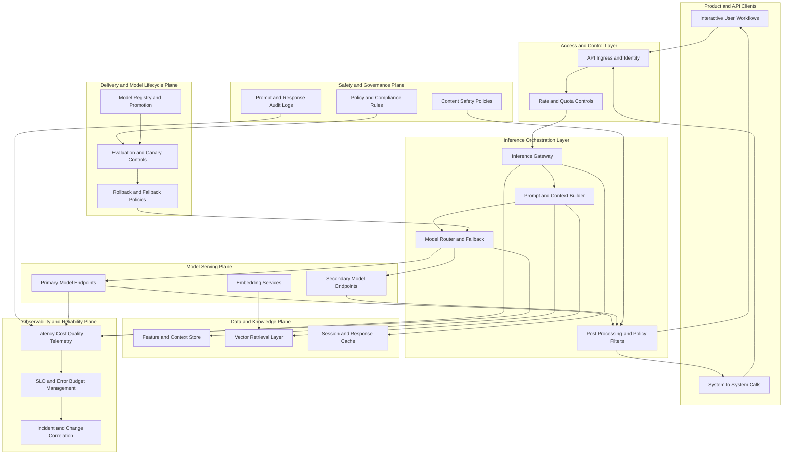

# Reference Architecture: AI Inference Platform

## Motivation

Organizations deploying AI-enabled products need a reliable architecture for serving models in production while controlling latency, safety, and cost.

## Business Problem

AI features create direct business value but can introduce unstable user experience and uncontrolled spend if deployed without platform-level controls.

## Engineering Problem

Inference systems combine application logic, model endpoints, data services, and governance policies, creating complex runtime dependencies and failure paths.

## Historical Evolution

AI delivery moved from isolated experiments to production inference systems integrated with product workflows, requiring stronger observability, release discipline, and guardrails.

## Core Concepts

This blueprint focuses on:

- Inference gateway and request shaping.
- Model routing and fallback strategies.
- Prompt and context enrichment pipelines.
- Safety and policy filters.
- Cost and latency governance loops.

## Architecture

### Architecture Notes

The design decouples application interaction from model execution so teams can control reliability and governance without blocking product iteration.

## Enterprise Perspective

Enterprises can use this blueprint to define a shared AI platform capability while allowing domain teams to own product-specific prompts, context policies, and evaluation criteria.

Typical outcomes:

- Faster and safer AI feature releases.
- Improved auditability for regulated workflows.
- Better control of latency and per-request cost.
- Reduced outage impact through routing and fallback patterns.

## AI Perspective

This architecture directly addresses production AI concerns: model drift, quality variability, prompt risks, and runtime economic constraints.

## Quality Attributes and Constraints

Primary quality attributes:

- Predictable latency under variable demand.
- Controlled quality and safety outcomes.
- Cost efficiency and quota governance.
- High availability with graceful degradation.

Typical constraints:

- Privacy and data residency requirements.
- Fast model iteration cycles.
- Uneven traffic patterns and workload bursts.

## Trade-Offs

Key trade-offs to evaluate:

- Model quality versus latency budget.
- Response richness versus cost per request.
- Strict safety filtering versus user flexibility.
- Centralized model governance versus team autonomy.

## Decision Tables

### Table 1: Model Routing Strategy

| Decision Area | Option A | Option B | Choose Option A When | Choose Option B When | Main Trade-Off |
|---|---|---|---|---|---|
| Primary inference routing | Single model route | Multi-model routing with fallback | Domain behavior is stable and predictable | Workload volatility or model failure risk is high | Operational simplicity versus resilience and adaptability |
| Model selection policy | Static policy by use case | Dynamic policy by latency cost quality signals | Inputs are homogeneous and predictable | Inputs vary and require runtime optimization | Deterministic behavior versus adaptive efficiency |
| Fallback behavior | Hard fail with clear user message | Graceful degrade to smaller or cached response | Critical use case must avoid uncertain output | Service continuity is more important than maximal output quality | Output certainty versus availability |

### Table 2: Context and Retrieval Design

| Decision Area | Option A | Option B | Choose Option A When | Choose Option B When | Main Trade-Off |
|---|---|---|---|---|---|
| Retrieval strategy | Real-time retrieval for each request | Cached context with periodic refresh | Query freshness is essential to correctness | Latency and cost must be tightly controlled | Freshness and precision versus response speed and cost |
| Prompt construction | Centralized prompt templates | Domain-owned prompt templates with shared guardrails | Governance and consistency are top priorities | Domain teams need rapid experimentation | Standardization versus innovation speed |
| Session handling | Stateless request processing | Stateful session memory and cache | Workflows are independent per request | Multi-step user interactions need continuity | Simplicity versus personalization and continuity |

### Table 3: Safety, Reliability, and Cost Controls

| Decision Area | Option A | Option B | Choose Option A When | Choose Option B When | Main Trade-Off |
|---|---|---|---|---|---|
| Safety policy placement | Post-response filtering only | Pre and post-response layered filtering | Risk profile is low and scope is internal | Domain has external users or regulatory obligations | Lower latency overhead versus stronger risk control |
| Traffic governance | Fixed quotas per tenant | Adaptive quotas by risk tier and business priority | Demand is predictable and fairness is simple | Demand is spiky and requires dynamic protection | Predictability versus utilization efficiency |
| Release strategy for models | Big-bang model promotion | Canary and shadow evaluation pipeline | Low criticality internal workloads | User-facing workloads with strict reliability objectives | Faster rollout versus safer evidence-based rollout |

## Failure Modes and Mitigations

- Primary model degradation: route to secondary model and degrade gracefully.
- Retrieval subsystem timeout: fallback to cached context or simplified prompt path.
- Cost spike event: enforce dynamic quotas and prioritization.
- Safety policy miss: add layered pre and post response filtering.

## Related Topics

- `docs/13-ai-cloud.md`
- `docs/09-observability.md`
- `docs/10-security.md`
- `patterns/canary-deployment.md`
- `patterns/circuit-breaker.md`

## Further Reading

- AI system reliability and evaluation frameworks.
- LLMOps platform design references.
- Responsible AI governance and risk management guidance.
