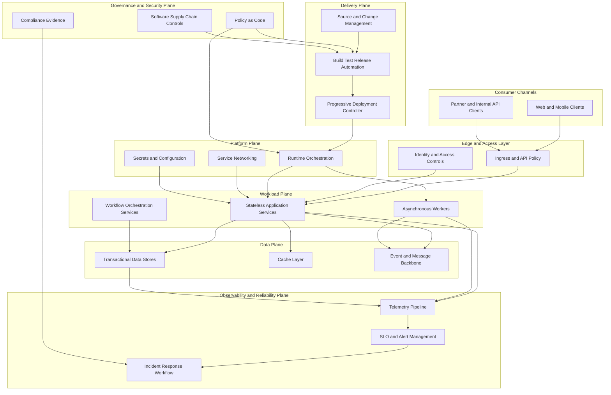

# Reference Architecture: Workload Platform Foundation

## Motivation

Most organizations need a reusable architecture baseline for running business applications with predictable reliability, security, and delivery speed.

## Business Problem

Teams often build workloads with inconsistent patterns, leading to slow onboarding, uneven compliance posture, and avoidable operational failures.

## Engineering Problem

Without a common architecture baseline, platform controls and application responsibilities are mixed, creating fragile deployments and high operational toil.

## Historical Evolution

Organizations evolved from environment-specific deployments to standardized runtime platforms with declarative operations, policy controls, and reliability engineering practices.

## Core Concepts

This blueprint separates concerns into:

- Workload plane for business services.
- Platform plane for runtime capabilities.
- Delivery plane for change automation.
- Governance plane for policy and risk controls.
- Observability and reliability plane for service outcomes.

## Architecture

### Architecture Notes

The architecture defines explicit boundaries between application concerns and platform concerns, enabling teams to scale delivery without re-implementing controls.

## Enterprise Perspective

Enterprises can standardize this blueprint as a reference model for product domains, then allow controlled variation at workload boundaries.

Typical outcomes:

- Faster team onboarding.
- Consistent security and compliance controls.
- Lower variance in incident response.
- Better traceability from change to runtime impact.

## AI Perspective

This architecture also supports AI-enabled applications by adding model-serving and feature workflows inside the workload plane while reusing platform, governance, and observability controls.

## Quality Attributes and Constraints

Primary quality attributes:

- Reliability and graceful degradation.
- Security and policy compliance.
- Deployment velocity with rollback safety.
- Operational transparency and diagnosability.

Typical constraints:

- Regulated data handling and auditability.
- Multi-team ownership with shared platform dependencies.
- Budget constraints requiring cost-aware scaling.

## Trade-Offs

Key trade-offs to evaluate:

- Standardization versus local team flexibility.
- Centralized platform ownership versus embedded operations.
- Synchronous APIs versus asynchronous workflows for resilience.
- Strict policy gates versus delivery throughput.

## Decision Tables

### Table 1: Service Interaction Strategy

| Decision Area | Option A | Option B | Choose Option A When | Choose Option B When | Main Trade-Off |
|---|---|---|---|---|---|
| Service interaction model | Synchronous request response | Asynchronous event workflow | User flow needs immediate confirmation with tight SLA | Workflow can complete eventually and requires resilience to dependency delays | Simplicity and immediacy versus decoupling and fault tolerance |
| State consistency | Strong consistency for critical writes | Eventual consistency with compensation | Domain has strict correctness and legal accuracy requirements | Domain tolerates delayed convergence and benefits from decoupling | Correctness guarantees versus scalability and throughput |
| API boundary | Fine-grained service APIs | Coarse-grained capability APIs | Teams need high internal reuse and stable internal contracts | Teams optimize for consumer simplicity and reduced chattiness | Flexibility and reuse versus reduced integration overhead |

### Table 2: Runtime Scaling and Isolation

| Decision Area | Option A | Option B | Choose Option A When | Choose Option B When | Main Trade-Off |
|---|---|---|---|---|---|
| Scaling direction | Horizontal scaling | Vertical scaling | Workload can run statelessly and traffic is variable | Workload is constrained by single-node memory or licensing behavior | Elasticity and resilience versus single-instance performance |
| Failure isolation | Shared runtime pool | Segmented runtime pools by criticality | Cost efficiency is primary and workloads have similar risk profiles | High-criticality workloads need blast-radius isolation | Resource efficiency versus isolation and predictability |
| Traffic handling | Queue-based buffering | Direct fail-fast responses | Work can be deferred without breaking user expectations | Users need immediate feedback and strict latency limits | Throughput smoothing versus low-latency clarity |

### Table 3: Delivery and Governance Controls

| Decision Area | Option A | Option B | Choose Option A When | Choose Option B When | Main Trade-Off |
|---|---|---|---|---|---|
| Deployment strategy | Progressive delivery with automated gates | Scheduled release windows | Team has strong telemetry and rollback automation | Domain requires strict coordination and change windows | Continuous risk-managed flow versus centralized release control |
| Policy enforcement | Blocking policy gates in pipeline | Advisory policy checks with exception workflow | Compliance and security requirements are strict and auditable | Team is early in maturity and needs migration runway | Safety and assurance versus delivery velocity |
| Platform ownership model | Central platform team with product model | Federated platform capabilities across domains | Organization needs high consistency and shared control | Domains are highly diverse and require tailored platform slices | Consistency and economies of scale versus local optimization |

## Failure Modes and Mitigations

- Dependency saturation: apply circuit breaker, timeout, and bulkhead controls.
- Release regression: use progressive delivery and automated rollback criteria.
- Policy drift: enforce policy as code in both delivery and runtime.
- Telemetry blind spots: enforce minimum instrumentation contracts.

## Related Topics

- `docs/07-cloud-native-architecture.md`
- `docs/11-reliability.md`
- `docs/12-platform-engineering.md`
- `patterns/gitops.md`
- `patterns/infrastructure-as-code.md`

## Further Reading

- Platform engineering operating model references.
- Reliability engineering and SLO frameworks.
- Policy-as-code and secure supply chain guidance.
