# Learning Path

## Purpose

This document defines a capability-oriented learning path for cloud-native engineering. It is sequenced to build durable reasoning skills before implementation detail. [Meadows, "Thinking in Systems"](https://wtf.tw/ref/meadows.pdf)

## Path Overview

1. Why cloud-native exists: business and engineering drivers. [NIST SP 800-145](https://nvlpubs.nist.gov/nistpubs/Legacy/SP/nistspecialpublication800-145.pdf)
2. Systems thinking: interdependencies, feedback loops, and constraints. [Senge, "The Fifth Discipline"](https://www.systems-thinking.org/the-fifth-discipline/)
3. Cloud and distributed systems fundamentals. [Tanenbaum & van Steen, "Distributed Systems"](https://www.distributed-systems.net/index.php/books/distributed-systems-3rd-edition-2017/) [Armbrust et al., "A View of Cloud Computing"](https://www2.eecs.berkeley.edu/Pubs/TechRpts/2009/EECS-2009-28.pdf)
4. Runtime abstractions: containers and orchestration. [OCI Image Spec](https://github.com/opencontainers/image-spec) [Kubernetes Docs](https://kubernetes.io/docs/concepts/overview/what-is-kubernetes/)
5. Architecture and delivery operating models. [CNCF Cloud Native Definition](https://github.com/cncf/toc/blob/main/DEFINITION.md)
6. Reliability, security, and observability as design constraints. [Google SRE Book](https://sre.google/sre-book/table-of-contents/) [OWASP SAMM](https://owaspsamm.org/) [OpenTelemetry](https://opentelemetry.io/)
7. Platform engineering and AI-era cloud-native evolution. [Team Topologies](https://teamtopologies.com/) [NIST AI RMF](https://airmf.nist.gov/)

## Recommended Sequence

```mermaid
flowchart LR
    W[01 Why Cloud Native] --> S[02 Systems Thinking]
    S --> C[03 Cloud Computing]
    C --> D[04 Distributed Systems]
    D --> X[05 Containers]
    X --> K[06 Kubernetes]
    K --> A[07 Cloud Native Architecture]
    A --> V[08 DevOps]
    V --> O[09 Observability]
    O --> Z[10 Security]
    Z --> R[11 Reliability]
    R --> P[12 Platform Engineering]
    P --> I[13 AI and Cloud Native]
```

## Study Guidance

- Read concept documents first, then pattern documents. [Bloom's Taxonomy](https://cft.vanderbilt.edu/guides-sub-pages/blooms-taxonomy/)
- Use case studies to examine trade-offs in real organizations. [Netflix Case Study](https://netflixtechblog.com/)
- Use labs to build implementation skills after conceptual mastery. [Kelsey Hightower's Kubernetes The Hard Way](https://github.com/kelseyhightower/kubernetes-the-hard-way)
- Revisit earlier documents as your architecture scope increases. [Continuous Learning, DORA](https://dora.dev/)

## Cross-References

- `docs/01-why-cloud-native.md`
- `docs/02-systems-thinking.md`
- `patterns/README.md`
- `case-studies/README.md`
